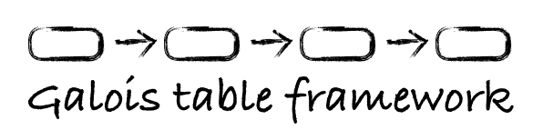

# Galois Table

`Galois table` (gtable) is a in-memory relational database (RDBMS) module implemented by modern C++, which supports large-scale real-time data synchronization and storage, and C++ pre-compiled SQL liked database query language `Galois table query language` (GQL).

# What's gtable for?

`Gtable` is suitable for industrial low latency data retrieval scenarios. Unlike traditional in-memory databases Redis, gtable aims to store structured data and support SQL like query mechanism and ensure low latency.

The most typical application scenario is : synchronizing the data in the business end (usually from MySQL) to the retrieval end (gtable application) in real time through `gdatabus` to realize separation of reading and writing, so that the information retrieval system can greatly reduce the time cost of data retrieval.

This model has been proved to be efficient in the industrialized online advertising retrieval system.

# Galois Query Language
